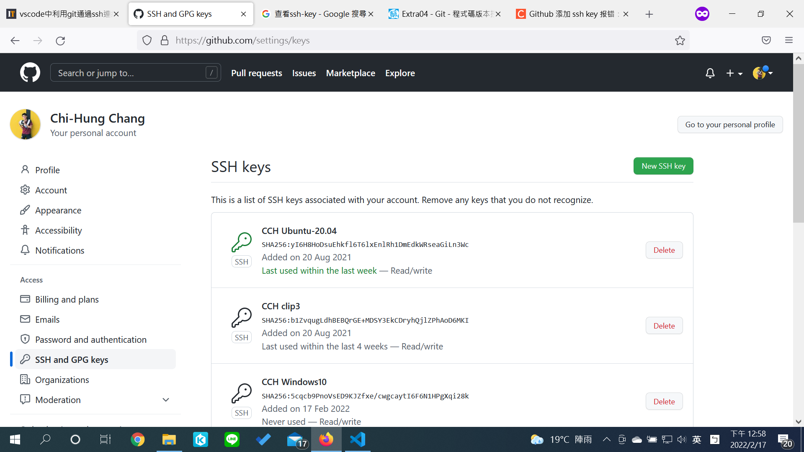

<!--
  backgroundImage: "linear-gradient(to bottom, #C4E1FF, #84C1FF)"
-->

<style>
h2{
    position: fixed;
    top: 30px;
}

img[alt~="left"] {
    display: block;
    margin: auto auto auto 30px;
}

img[alt~="center"] {
    display: block;
    margin: 0 auto;
}

img[alt~="right"] {
    display: block;
    margin: auto 30px auto auto;
}
</style>

# Computer Programming II Lab
張麒竑
Feb 17, 2022

---

# 助教們

- [張麒竑](mailto:chihung861224@gmail.com)
- [簡傑](mailto:mozixreality@gmail.com)
- [江宗樺](https://www.facebook.com/Ruck0629/)
- [許凱竣](https://www.facebook.com/profile.php?id=100004128721799)
- [吳武峰](mailto:tcfshcos8@gmail.com)

---

# Outline

- 版本控制系統 - Git
    - Git
    - GitHub
    - 基本操作
    - 參考資料

- LeetCode
    - 辦個帳號來玩玩看吧

- 歡樂的解題時間(?)
    - LeetCode 1. Two Sum
    - OJ

---

# 版本控制系統 - Git


---

## Git

- Git 可以把檔案的狀態作為更新歷史記錄保存起來。因此可以把編輯過的檔案復原到以前的狀態，也可以顯示編輯過內容的差異。

- 當有人想將編輯過的舊檔案上傳到伺服器、覆蓋其他人的最新檔案時，系統會發出警告，因此可以避免在無意中覆蓋他人的編輯內容。

---

## Git


---

## 安裝 Git

- Windows
    [https://git-scm.com/downloads](https://git-scm.com/downloads)

- MacOS
    ```bash
    brew install git
    ```

- Linux (Ex. Ubuntu)
    ```bash
    apt-get install git
    ```

---


---

## 在 GitHub 註冊帳號

[https://github.com/](https://github.com/)


---

## 登入你的 GitHub 帳號


---

## 設定你的 Local 端配置

```bash
git config --global user.name <your_name>
git config --global user.email <your_email>
```

```bash
(^o^) [cch] [~/Documents/1102cp2_lab/Lab_20220217] $ git config --global user.name "Chi-Hung Chang"
(^o^) [cch] [~/Documents/1102cp2_lab/Lab_20220217] $ git config --global user.email "chihung861224@gmail.com"
(^o^) [cch] [~/Documents/1102cp2_lab/Lab_20220217] $ git config --list
user.name=Chi-Hung Chang
user.email=chihung861224@gmail.com
core.repositoryformatversion=0
core.filemode=true
core.bare=false
core.logallrefupdates=true
remote.origin.url=git@github.com:chang861224/1102cp2_lab.git
remote.origin.fetch=+refs/heads/*:refs/remotes/origin/*
branch.main.remote=origin
branch.main.merge=refs/heads/main
(^o^) [cch] [~/Documents/1102cp2_lab/Lab_20220217] $
```

---

## 基本操作

- 在自己的 GitHub 上面創建一個資料夾


---

## 基本操作

- 將 GitHub 上面的資料夾下載到自己的電腦 Local 端
    ```bash
    git clone <repository_url>
    ```

    ```bash
    (^o^) [cch] [~/Documents] $ git clone git@github.com:chang861224/1102cp2.git
    Cloning into '1102cp2'...
    remote: Enumerating objects: 3, done.
    remote: Counting objects: 100% (3/3), done.
    remote: Total 3 (delta 0), reused 0 (delta 0), pack-reused 0
    Receiving objects: 100% (3/3), done.
    (^o^) [cch] [~/Documents] $ ls -l
    drwxrwxr-x  3 cch cch  4096 Feb 16 21:45 1102cp2
    drwxrwxr-x  5 cch cch  4096 Feb 16 16:27 1102cp2_lab
    (^o^) [cch] [~/Documents] $
    ```

---

## 基本操作

- 進入資料夾，查看資料夾狀態
    ```bash
    cd <repository_name>
    git status
    ```

    ```bash
    (^o^) [cch] [~/Documents] $ cd 1102cp2
    (^o^) [cch] [~/Documents/1102cp2] $ vim test.c
    (^o^) [cch] [~/Documents/1102cp2] $ git status
    On branch main
    Your branch is up to date with 'origin/main'.

    Untracked files:
      (use "git add <file>..." to include in what will be committed)
        test.c

    nothing added to commit but untracked files present (use "git add" to track)
    (^o^) [cch] [~/Documents/1102cp2] $
    ```

---

## 基本操作

- 新增修改的檔案
    ```bash
    git add <filenames>
    ```

    ```bash
    (^o^) [cch] [~/Documents/1102cp2] $ git add test.c
    (^o^) [cch] [~/Documents/1102cp2] $ git status
    On branch main
    Your branch is up to date with 'origin/main'.

    Changes to be committed:
      (use "git restore --staged <file>..." to unstage)
        new file:   test.c

    (^o^) [cch] [~/Documents/1102cp2] $
    ```

---

## 基本操作

- 新增 commit，然後上傳 GitHub
    ```bash
    git commit -m <your_commits>
    git push origin main
    ```

    ```bash
    (^o^) [cch] [~/Documents/1102cp2] $ git commit -m "add hellow world"
    [main cc1632b] add hellow world
     1 file changed, 6 insertions(+)
     create mode 100644 test.c
    (^o^) [cch] [~/Documents/1102cp2] $ git push origin main
    Enumerating objects: 4, done.
    Counting objects: 100% (4/4), done.
    Delta compression using up to 4 threads
    Compressing objects: 100% (3/3), done.
    Writing objects: 100% (3/3), 355 bytes | 355.00 KiB/s, done.
    Total 3 (delta 0), reused 0 (delta 0)
    To github.com:chang861224/1102cp2.git
       ac0ce95..cc1632b  main -> main
    ```

---

## 基本操作

接下來再去你的 GitHub 的這個資料夾，就可以看到你上傳的檔案


---

## 設定 SSH-KEY

不知從何時開始，GitHub 不在能用 HTTPS 進行上傳，因此需要先設定 SSH-KEY 才能用 CLI 進行上傳
```bash
ssh-keygen -t rsa -C <your_email>
```

```bash
(^o^) [cch] [~/Documents/1102cp2] $ ssh-keygen
Generating public/private rsa key pair.
Enter file in which to save the key (/c/Users/Chi-Hung Chang/.ssh/id_rsa): 
Enter passphrase (empty for no passphrase): 
Enter same passphrase again: 
Your identification has been saved in /c/Users/Chi-Hung Chang/.ssh/id_rsa 
Your public key has been saved in /c/Users/Chi-Hung Chang/.ssh/id_rsa.pub 
The key fingerprint is:
SHA256:5cqcb9PnoVsED9KJZfxe/cwgcaytI6F6N1HPgXqi28k Chi-Hung Chang@cch20-pc
The key's randomart image is:
```

---

## 設定 SSH-KEY

在家目錄底下就會出現一個 `.ssh` 資料夾，裡面有兩個檔案，其中 `id_rsa.pub` 存的是 SSH 金鑰
```bash
(^o^) [cch] [~/Documents/1102cp2] $ cd ~/.ssh
(^o^) [cch] [~/.ssh] $ ls -l
-rw-r--r--  1 cch cch  2610 Feb 17 12:44 id_rsa
-rw-r--r--  1 cch cch   577 Feb 17 12:44 id_rsa.pub
(^o^) [cch] [~/.ssh] $ cat id_rsa.pub
ssh-rsa ................................................ Chi-Hung Chang @cch20-pc
(^o^) [cch] [~/.ssh] $
```

---

## 設定 SSH-KEY

- 在你的 GitHub 帳號點選 `setting` （在右上角個人帳號點下去的倒數第二個）

- 點選左側的 `SSH and GPG Keys`


---

## 設定 SSH-KEY

點選右上角綠色的 `New SSH key`，並將剛剛在 `id_rsa.pub` 內的 SSH 金鑰複製進去


---

## 設定 SSH-KEY

完成後按 `Add SSH key`，就會回到 SSH keys的頁面，你剛剛新增的 SSH key 也會出現（如果一切正常的話啦）



---

## 基本操作

- 查看版本歷史紀錄
    ```bash
    git log
    ```

    ```bash
    (^o^) [cch] [~/Documents/1102cp2] $ git log
    commit cc1632b294d9460864c459c393796012bb1a6bc1 (HEAD -> main, origin/main, origin/HEAD)
    Author: Chi-Hung Chang <chihung861224@gmail.com>
    Date:   Thu Feb 17 01:53:40 2022 +0800

        add hellow world

    commit ac0ce95c6c8e70bf0790a013ca1b7e55fe6f9091
    Author: Chi-Hung Chang <chihung861224@gmail.com>
    Date:   Wed Feb 16 21:35:17 2022 +0800

        Initial commit
    (^o^) [cch] [~/Documents/1102cp2] $
    ```

---

## 參考資料

- [1.6 開始 - 初次設定 Git](https://git-scm.com/book/zh-tw/v2/%E9%96%8B%E5%A7%8B-%E5%88%9D%E6%AC%A1%E8%A8%AD%E5%AE%9A-Git)

- [2.3 Git 基礎 - 檢視提交的歷史記錄](https://git-scm.com/book/zh-tw/v2/Git-%E5%9F%BA%E7%A4%8E-%E6%AA%A2%E8%A6%96%E6%8F%90%E4%BA%A4%E7%9A%84%E6%AD%B7%E5%8F%B2%E8%A8%98%E9%8C%84)

- [連猴子都能懂的 Git 入門指南](https://backlog.com/git-tutorial/tw/intro/intro1_1.html)

- [Git 與 GitHub 版本控制基本指令與操作入門教學](https://blog.techbridge.cc/2018/01/17/learning-programming-and-coding-with-python-git-and-github-tutorial/)

- [30 天精通 Git 版本控管](https://github.com/doggy8088/Learn-Git-in-30-days/blob/master/zh-tw/README.md)

- [vscode 中利用 git 通過 ssh 連線 github 的方法](https://www.itread01.com/article/1510281098.html)

- [Git Tutorial](https://git-scm.com/docs/gittutorial)

---

# LeetCode

[https://leetcode.com/](https://leetcode.com/)

---

## 申請一個帳號


---

## 題目列表之很多的題目


有興趣，閒閒沒事做的時候就可以隨便找幾題來寫～（追隨老師的腳步XD）
或者可以每天寫一題系統隨機跳出來的隨機任務～

---

# 歡樂的解題時間

- LeetCode

- Online Judge

---

## [LeetCode 1. Two Sum](https://leetcode.com/problems/two-sum/)

給你一個數字的陣列，以及一個 target neumber，你的目標是要在這個數字陣列中找出兩個元素（不能重複取），其相加結果會等於 target number，並回傳這兩個元素的 index。

- 範例輸入：`nums = [2,7,11,15], target = 9`
- 範例輸出：`[0,1]`

題目限制：

- `1 <= nums,length <= 10^4`
- `-10^9 <= nums[i] <= 10^9`
- `-10^9 <= target <= 10^9`
- 只會有唯一一組解！

特別注意：題目是要你寫一個 solution 的 function，不是要你寫出整組程式！

---

## LeetCode 1. Two Sum

解題思路

1. Brute force：兩層 for 迴圈，遇到相加等於 target number 時就回傳

    - 時間複雜度：$O(n^2)$
    - 空間複雜度：$O(1)$

2. hash table：先計算每個數字各出現幾次，再看哪兩個數字和等於 target number

    - 時間複雜度：$O(n)$
    - 空間複雜度：$O(n)$

---

## [Online Judge 越大我越愛](https://oj.ebg.tw/contest/83/problem/1102CP2%20Assign01)

有 `n` 個數字存放於陣列 `a` 內，現在想要找兩個數字，`i` 跟 `j`（`i < j`），使得 `a[i] - a[j]` 越大越好。

- 輸入說明
    
    - 第一行有個數字 `n`，代表現在有 `n` 個數字
    - 接下來一行 `a[1] , a[2] .... , a[n]`

- 輸出說明

    - `a[i] - a[j]` 的最大值

---

## Online Judge 越大我越愛

- 範例輸入
    ```
    5
    5 4 3 2 1
    ```

- 範例輸出
    ```
    4
    ```

題目限制：

- `2 <= n <= 100000`
- `1 <= a[i], a[j] <= 100000`
- `i < j`

---

# Any Question?

