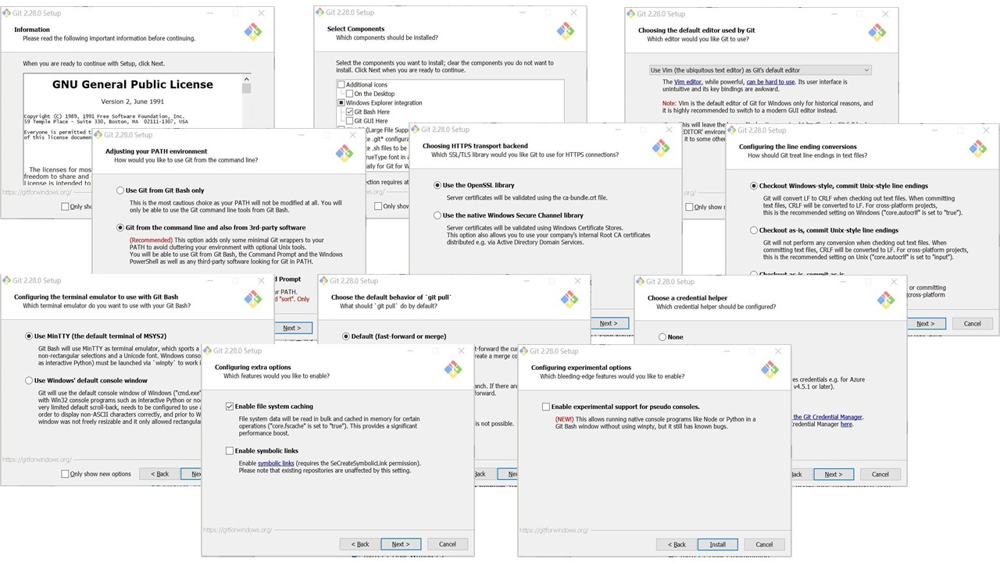
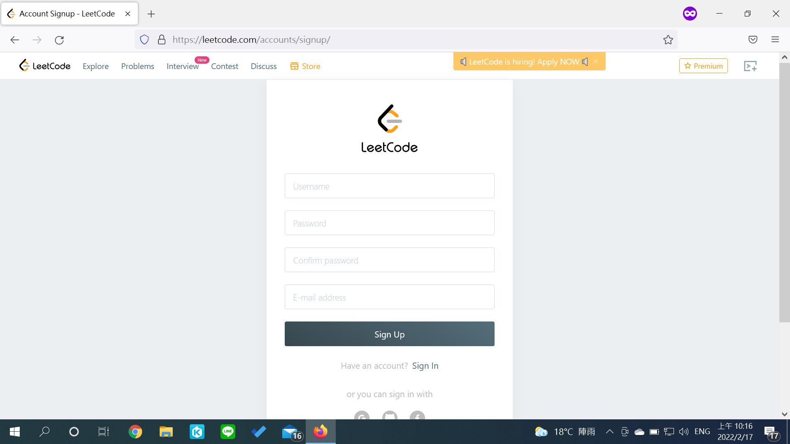

<style>
h2{
    position: fixed;
    top: 30px;
}

img[alt~="left"] {
    display: block;
    margin: auto auto auto 30px;
}

img[alt~="center"] {
    display: block;
    margin: 0 auto;
}

img[alt~="right"] {
    display: block;
    margin: auto 30px auto auto;
}
</style>

# Computer Programming II Lab
張麒竑
Feb 17, 2022

---

# 助教們

- [張麒竑](mailto:chihung861224@gmail.com)
- [簡傑](mailto:mozixreality@gmail.com)
- [江宗樺](https://www.facebook.com/Ruck0629/)
- [許凱竣](https://www.facebook.com/profile.php?id=100004128721799)
- [吳武峰](mailto:tcfshcos8@gmail.com)

---

# Outline

- 版本控制系統 - Git
    - Git
    - GitHub
    - 基本操作
    - 參考資料

- LeetCode

---

# 版本控制系統 - Git


---

## Git

- Git 可以把檔案的狀態作為更新歷史記錄保存起來。因此可以把編輯過的檔案復原到以前的狀態，也可以顯示編輯過內容的差異。

- 當有人想將編輯過的舊檔案上傳到伺服器、覆蓋其他人的最新檔案時，系統會發出警告，因此可以避免在無意中覆蓋他人的編輯內容。

---

## Git


---

## 安裝 Git

- Windows
    [https://git-scm.com/downloads](https://git-scm.com/downloads)

- MacOS
    ```bash
    brew install git
    ```

- Linux (Ex. Ubuntu)
    ```bash
    apt-get install git
    ```

---



---

## 在 GitHub 註冊帳號

[https://github.com/](https://github.com/)


---

## 登入你的 GitHub 帳號


---

## 設定你的 Local 端配置

```bash
git config --global user.name <your_name>
git config --global user.email <your_email>
```

```bash
(^o^) [cch] [~/Documents/1102cp2_lab/Lab_20220217] $ git config --global user.name "Chi-Hung Chang"
(^o^) [cch] [~/Documents/1102cp2_lab/Lab_20220217] $ git config --global user.email "chihung861224@gmail.com"
(^o^) [cch] [~/Documents/1102cp2_lab/Lab_20220217] $ git config --list
user.name=Chi-Hung Chang
user.email=chihung861224@gmail.com
core.repositoryformatversion=0
core.filemode=true
core.bare=false
core.logallrefupdates=true
remote.origin.url=git@github.com:chang861224/1102cp2_lab.git
remote.origin.fetch=+refs/heads/*:refs/remotes/origin/*
branch.main.remote=origin
branch.main.merge=refs/heads/main
(^o^) [cch] [~/Documents/1102cp2_lab/Lab_20220217] $
```

---

## 基本操作

- 在自己的 GitHub 上面創建一個資料夾


---

## 基本操作

- 將 GitHub 上面的資料夾下載到自己的電腦 Local 端
    ```bash
    git clone <repository_url>
    ```

    ```bash
    (^o^) [cch] [~/Documents] $ git clone git@github.com:chang861224/1102cp2.git
    Cloning into '1102cp2'...
    remote: Enumerating objects: 3, done.
    remote: Counting objects: 100% (3/3), done.
    remote: Total 3 (delta 0), reused 0 (delta 0), pack-reused 0
    Receiving objects: 100% (3/3), done.
    (^o^) [cch] [~/Documents] $ ls -l
    drwxrwxr-x  3 cch cch  4096 Feb 16 21:45 1102cp2
    drwxrwxr-x  5 cch cch  4096 Feb 16 16:27 1102cp2_lab
    (^o^) [cch] [~/Documents] $
    ```

---

## 基本操作

- 進入資料夾，查看資料夾狀態
    ```bash
    cd <repository_name>
    git status
    ```

    ```bash
    (^o^) [cch] [~/Documents] $ cd 1102cp2
    (^o^) [cch] [~/Documents/1102cp2] $ vim test.c
    (^o^) [cch] [~/Documents/1102cp2] $ git status
    On branch main
    Your branch is up to date with 'origin/main'.

    Untracked files:
      (use "git add <file>..." to include in what will be committed)
        test.c

    nothing added to commit but untracked files present (use "git add" to track)
    (^o^) [cch] [~/Documents/1102cp2] $
    ```

---

## 基本操作

- 新增修改的檔案
    ```bash
    git add <filenames>
    ```

    ```bash
    (^o^) [cch] [~/Documents/1102cp2] $ git add test.c
    (^o^) [cch] [~/Documents/1102cp2] $ git status
    On branch main
    Your branch is up to date with 'origin/main'.

    Changes to be committed:
      (use "git restore --staged <file>..." to unstage)
        new file:   test.c

    (^o^) [cch] [~/Documents/1102cp2] $
    ```

---

## 基本操作

- 新增 commit，然後上傳 GitHub
    ```bash
    git commit -m <your_commits>
    git push origin main
    ```

    ```bash
    (^o^) [cch] [~/Documents/1102cp2] $ git commit -m "add hellow world"
    [main cc1632b] add hellow world
     1 file changed, 6 insertions(+)
     create mode 100644 test.c
    (^o^) [cch] [~/Documents/1102cp2] $ git push origin main
    Enumerating objects: 4, done.
    Counting objects: 100% (4/4), done.
    Delta compression using up to 4 threads
    Compressing objects: 100% (3/3), done.
    Writing objects: 100% (3/3), 355 bytes | 355.00 KiB/s, done.
    Total 3 (delta 0), reused 0 (delta 0)
    To github.com:chang861224/1102cp2.git
       ac0ce95..cc1632b  main -> main
    ```

---

## 基本操作

- 查看版本歷史紀錄
    ```bash
    git log
    ```

---

## 參考資料

- [1.6 開始 - 初次設定 Git](https://git-scm.com/book/zh-tw/v2/%E9%96%8B%E5%A7%8B-%E5%88%9D%E6%AC%A1%E8%A8%AD%E5%AE%9A-Git)
- [連猴子都能懂的 Git 入門指南](https://backlog.com/git-tutorial/tw/intro/intro1_1.html)
- [Git 與 GitHub 版本控制基本指令與操作入門教學](https://blog.techbridge.cc/2018/01/17/learning-programming-and-coding-with-python-git-and-github-tutorial/)
- [30 天精通 Git 版本控管](https://github.com/doggy8088/Learn-Git-in-30-days/blob/master/zh-tw/README.md)
- [Git Tutorial](https://git-scm.com/docs/gittutorial)

---

# LeetCode

[https://leetcode.com/](https://leetcode.com/)

---

## 申請一個帳號



---

## 題目列表之很多的題目


