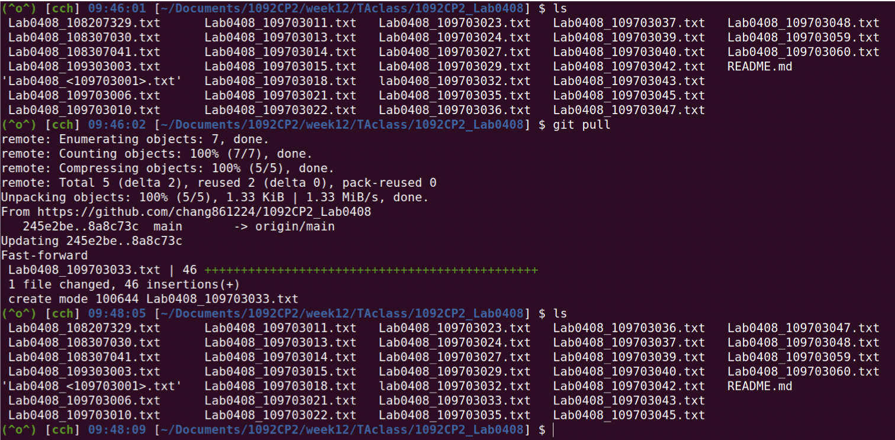
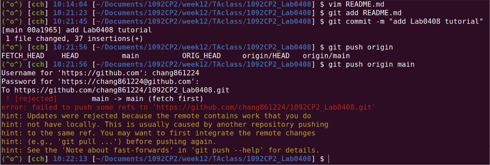
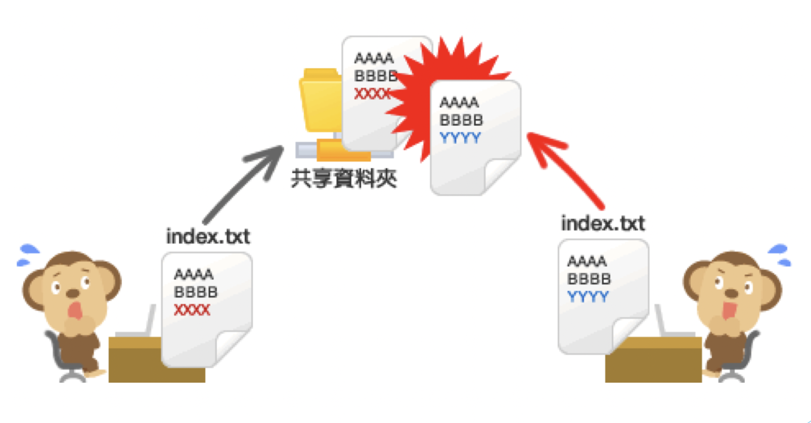

<style>
h2{
    position: absolute;
    top: 50px;
}

img[alt~="left"] {
    display: block;
    margin: auto auto auto 30px;
}

img[alt~="center"] {
    display: block;
    margin: 0 auto;
}

img[alt~="right"] {
    display: block;
    margin: auto 30px auto auto;
}
</style>

# Computer Programming II Lab
張麒竑
April 28, 2022

---

# Outline

- 版本控制系統 - Git
- Online Judge
- LeetCode

---

# 版本控制系統 - Git


---

## Git

- Git 可以把檔案的狀態作為更新歷史記錄保存起來。因此可以把編輯過的檔案復原到以前的狀態，也可以顯示編輯過內容的差異。

- 當有人想將編輯過的舊檔案上傳到伺服器、覆蓋其他人的最新檔案時，系統會發出警告，因此可以避免在無意中覆蓋他人的編輯內容。

---

## Git


---

## 多人合作

- 單人多裝置（單分支）
- 單人多分支
- **多人多分支**

---

## 多人多分支

**情境：當有多個人在相同/不同裝置上開發同一個專案** $\Rightarrow$ 會出現多種差異版本

- 將 GitHub 上的專案 fork 到自己的資料夾下
- 更新專案到最新版本
    - 如果 local 端沒有專案資料夾：把 GitHub 上的資料夾 clone 下來
    - 如果 local 端已有專案資料夾：**更新到最新版本**
        ```bash
        git pull <remote_name>
        ```
- 確認遠端
    ```bash
    git remote      # 顯示你的遠端名稱
    git remote -v   # 顯示你的遠端名稱及所用的網址
    git remote add <remote_name> <URL>      # 新增遠端版本庫
    ```

---

## 多人多分支

**情境：當有多個人在相同/不同裝置上開發同一個專案** $\Rightarrow$ 會出現多種版本差異

- 確認分支
    ```bash
    git branch      # 查看所處分支
    git branch <branch_name>        # 新增分支
    git checkout <branch_name>      # 切換分支
    git merge <branch_name>         # 合併分支
    ```
- 編輯專案（coding time....）
- 提交更新版本
- 上傳到 GitHub
    ```bash
    git push <remote_name> <branch_name>
    ```
- **在 GitHub 上面發 PR（Pull Request）給原始資料夾擁有者**

---

## 多人合作

- 多人合作的第一件事，一定要先 `git pull`！！



---

## 多人合作

- 如果你沒有先 pull 的話....



---

## 多人合作



---

## 如果你發現你的程式完全寫錯了....

```bash
git reset --hard
```

但有幾件事情需要注意！！

- 這個指令預設只會重置「引索狀態」！！
- 刪除（`rm`）或是更名（`mv`）的檔案都是無法透過 `git reset` 把實體檔案救回來的！！

---

## Bonus Time

**這些動作要在今天 23:59 前完成，才會有 bonus 喔！**

1. 進入之前 clone 到你的電腦 local 端的 **1102CP2_Lab0317** 資料夾
    （如果已經砍掉的話，就在你自己的 GitHub 上面再 clone 一次）
2. 用 `git remote` 新增 [git@github.com:chang861224/1102CP2_Lab0317.git](git@github.com:chang861224/1102CP2_Lab0317.git) 這個遠端網址
    （用 git bash 的人，麻煩新增 [https://github.com/chang861224/1102CP2_Lab0317.git](https://github.com/chang861224/1102CP2_Lab0317.git)）
3. 將你的電腦 local 端的 1102_CP2_Lab0317 資料夾更新到最新版本（要更新到跟我的 GitHub 一樣才是最新版本）
4. 進入上次你創建的「**NCCU_<你的學號>**」這個 branch

---

## Bonus Time

5. 在這裡修改你上次檔名為「Lab0317_<你的學號>.txt」的歌詞，在檔案的最前面新增歌名和作詞、作曲人
6. 在 commit 打「[add info] <你的學號>: <歌名>」
7. 將更新後的這個分支 push 到你自己的 GitHub 上，然後發一個 PR 給我

註：要在「**你新增的 branch 上傳然後發 PR**」，而不是直接在你的 main 分支上傳！

---

## Reference

- [連猴子都能懂的Git入門指南](https://backlog.com/git-tutorial/tw/stepup/stepup2_7.html)
- [30 天精通 Git 版本控管](https://github.com/doggy8088/Learn-Git-in-30-days/blob/master/zh-tw/README.md)
- [Git Tutorial](https://git-scm.com/docs/gittutorial)

---

# Online Judge

---

## 兩個子陣列的中位數

輸入兩個已經事先排序的非遞減序列 $A$ 與 $B$，再輸入 $n$ 筆查詢。每筆查詢為四個數字，$\rm l_a$、$\rm r_a$、$\rm l_b$ 和 $\rm r_b$。
$\rm l_a$ 與 $\rm r_a$ 是 $A$ 的子陣列的範圍，$\rm l_b$ 與 $\rm r_b$ 是 $B$ 的子陣列的圍範。
請輸出這兩個子陣列所有的元素的中位數。

---

## 兩個子陣列的中位數

- 輸入
    第一行為 $A$ 陣列的大小
    第二行為 $A$ 陣列的內容
    第三行為 $B$ 陣列的大小
    第四行為 $B$ 陣列的內容
    第五行為 $n$ 筆查詢
    接下來有 $n$ 行 $A$ 的子陣列範圍（$\rm l_a$～$\rm r_a$）和 $B$ 的子陣列範圍（$\rm l_b$～$\rm r_b$）
- 輸出
    兩個子陣列合起來的中位數


---

## 兩個子陣列的中位數

**特別注意！（錯了別怪我沒說）**

- $\rm l_a$、$\rm r_a$、$\rm l_b$ 和 $\rm r_b$ 為 $A$ 陣列和 $B$ 陣列的 index，其中「**含左不含右**」！！
    例如查詢為「$1\ 3\ 2\ 4$」，則 $A$ 陣列的子陣列取的是 $A[1]$、$A[2]$，並沒有 $A[3]$！！
- $0 < |A|, |B| < 10,000$
    $0 < n < 10,000$
    $0 \leq \rm l_a < \rm r_a \leq \it  |A|$
    $0 \leq \rm l_b < \rm r_b \leq \it |B|$
- **要用 $O(\log N)$ 的方法在兩個陣列上找中位數！！**

---

- Sample Input
    ```
    3
    1 2 3
    5
    1 2 2 3 5
    3
    0 3 0 5
    0 2 1 4
    1 3 2 4
    ```
- Sample Output
    ```
	2 2
	2
	2 3
	
	/* 說明 */
	# 第一個查詢可得 A 的子陣列為 1 2 3，B 的子陣列為 1 2 2 3 5，中位數有兩個，恰好都為 2
	# 第二個查詢可得 A 的子陣列為 1 2，B 的子陣列為 2 2 3，中位數有一個，為 2
	# 第三個查詢可得 A 的子陣列為 2 3，B 的子陣列為 2 3，中位數有兩個，分別為 2 3
	```

---

# LeetCode

[274. H-Index](https://leetcode.com/problems/h-index/)

---

## 重要公告

很重要！很重要！很重要！
前半個學期的 Leetcode 加分統計到**本週日**（**2022/05/01 23:59**）！！

如果有做要加分，可以這麼做：

1. 直接找隨便一個助教，然後開你的 Leetcode 頁面給我們當場檢查（前提你要先找到我們）
2. 將你做題目的作答紀錄截圖下來，寄給或傳給任一位助教（但助教不會通靈，所以請附上你的學號）

超過時間的話，就只能跟你的分數說掰掰了喔！（← By 簡傑XD）
但這也只是加分而已啦～沒有強制一定要寫～開心就好開心就好XDD

---

# Any Question?

