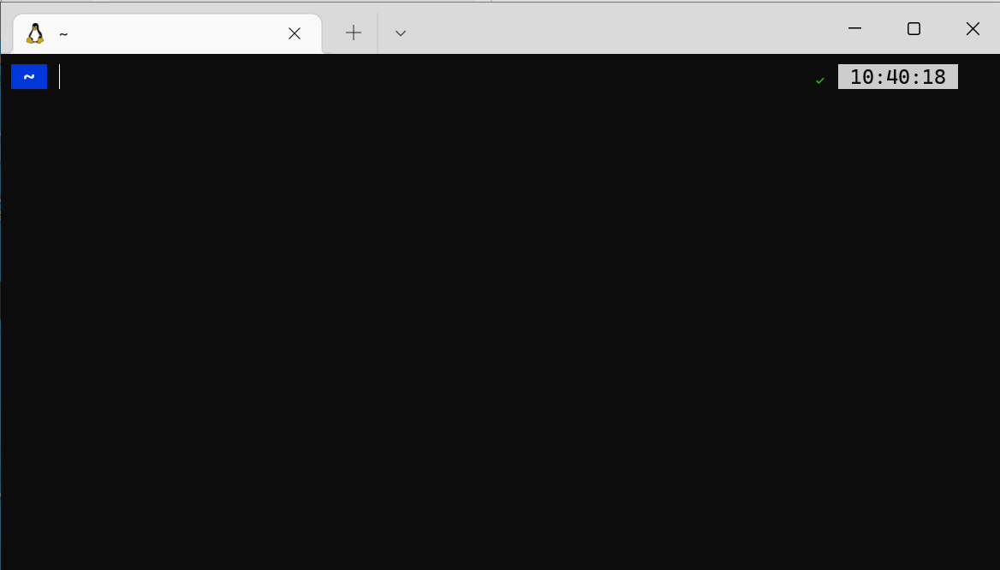
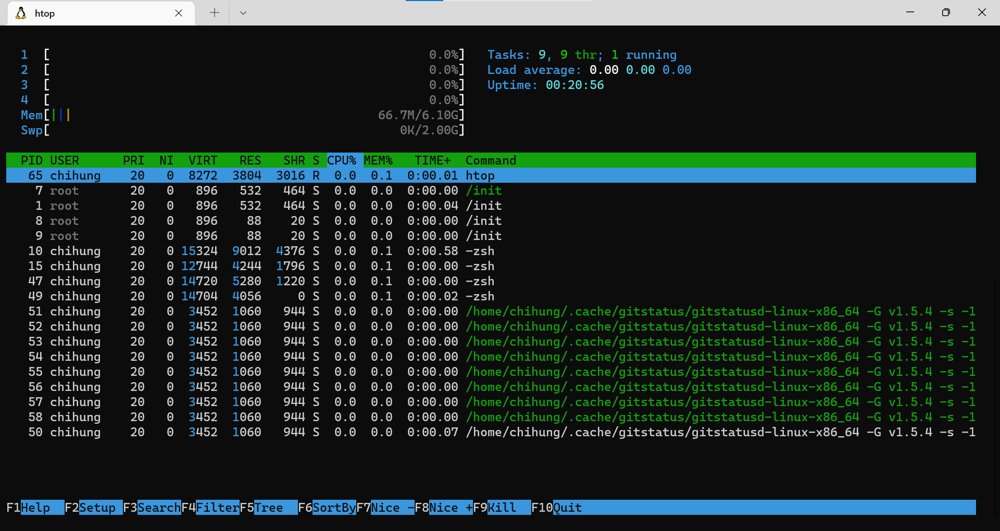

<style>
h2{
    position: absolute;
    top: 50px;
}

img[alt~="left"] {
    display: block;
    margin: auto auto auto 30px;
}

img[alt~="center"] {
    display: block;
    margin: 0 auto;
}

img[alt~="right"] {
    display: block;
    margin: auto 30px auto auto;
}
</style>

# Computer Programming II Lab
張麒竑
June 2, 2022

---

# Outline

- Terminal
- Makefile
- Final Project

---

# Terminal

- Ubuntu
- WSL
- Bash & zsh
- Linux Commands
- Vim

---

## Ubuntu

Ubuntu 是著名的 Linux 發行版之一，也是目前最多使用者的 Linux 版本。

Ubuntu 每六個月（即每年的四月與十月）釋出一個新版本，長期支援（LTS）版本每兩年釋出一次。普通版本一般只支援9個月，但LTS版本一般能提供5年的支援。

If 如果假設你想在 Windows 作業系統外，在額外裝 Ubuntu 作業系統，你可以跟著 Reference 裡面的 [(Ubuntu)安裝Win10 Ubuntu18.04 雙系統](https://medium.com/ai%E5%8F%8D%E6%96%97%E5%9F%8E/ubuntu-%E5%AE%89%E8%A3%9Dwin10-ubunto18-04-%E9%9B%99%E7%B3%BB%E7%B5%B1-a53870382df6) 進行安裝（但真的有需要再裝就好....），或者也可以安裝虛擬機（在 Reference 裡面一樣有提供連結）

---

## WSL (Windows Subsystem for Linux)

適用於 Linux 的 Windows 子系統可讓開發人員執行 GNU/Linux 環境（包括大部分的命令列工具、公用程式和應用程式），直接在 Windows 上執行，不需進行修改，不會造成傳統虛擬機器或 dualboot 設定的額外負荷。

- 執行一般的命令列工具
- 執行 Bash 命令介面指令碼和 GNU/Linux 命令列應用程式
- 使用自己的 GNU/Linux 散發套件管理員安裝其他軟體
- 使用類似 Unix 的命令列命令介面來叫用 Windows 應用程式
- 在 Windows 上叫用 GNU/Linux 應用程式

---

## WSL (Windows Subsystem for Linux)

If 如果假設你想裝的話....

- 先決條件
    - Windows 10 2004 或更新版本，或 Windows 11
    - [舊版 WSL 手動安裝](https://docs.microsoft.com/zh-tw/windows/wsl/install-manual)
    
---

## WSL (Windows Subsystem for Linux)
- 安裝步驟
    - 以 **系統管理員** 開啟 PowerShell 或 Windows cmd（命令提示字元）
    - 查看版本清單
        ```bash
        wsl --list --online
        ```
    - 指定版本安裝
        ```bash
        wsl --install -d <DistroName>
        ```
    - 重新開機
    - 開機完後，系統會自己跳出視窗，把後續該安裝好的都安裝好，此時....呼吸就好

---

## WSL (Windows Subsystem for Linux)



---

## WSL (Windows Subsystem for Linux)

額外的一些小癖好....

因為我實在是不太喜歡 Windows cmd 用的新細明體，所以我推薦用 **終端機**（或者叫 **terminal**）來使用 WSL！

- 可以直接在 Microsoft Store 上搜尋「終端機」或「terminal」，找到「Windows Terminal」後就進行安裝
- 當安裝好後，即可將它開啟，預設應該會是 PowerShell，可以在「設定」那邊將開啟的預設改成 WSL（當 WSL 安裝好某個版本後，應該會顯示該版本而不會是 WSL，例如 Ubuntu-20.04）

---

## Bash & zsh

- Bash
    - Bash 是一個命令處理器，通常執行於文字窗口中，並能執行使用者直接輸入的命令。Bash 還能從檔案中讀取命令，這樣的檔案稱為指令碼。和其他 Unix shell 一樣，它支援檔名替換（萬用字元匹配）、管道、here 文件、命令替換、變數，以及條件判斷和迴圈遍歷的結構控制語句
    - Bash 設定檔存在 `~/.bashrc` 裡面，歷史指令紀錄則是存在 `~/.bash_history` 內
- Z Shell
    - Z shell（Zsh）是一款可用作互動式登入的shell及指令碼編寫的命令直譯器
    - Z shell 設定檔存在 `~/.zshrc` 裡面，歷史指令紀錄存在 `~/.zsh_history` 內

---

## Bash & zsh

麒竑的推薦時間～

因為 bash 是預設的，沒意外的話 WSL 剛安裝好都會是用 bash，而我向要推薦大家也裝 zsh 來玩玩看～搞不好會發現 zsh 比 bash 好用XDD

（macOS 預設就是用 zsh，也可以跟著一起玩玩看 zsh 有什麼好玩的東西～）

---

## Bash & zsh

一些必要的套件要先裝好：`wget`、`git`、`curl`、`vim`

```bash
sudo apt install wget git curl vim -y
```

- 如果是剛安裝好的 WSL，有可能會有些套件沒有裝，下這個指令可以直接幫你裝好！
- 如果原本就有裝好的話，指令會直接顯示已安裝然後跳過，所以不用擔心衝突的部分～

---

## Bash & zsh

安裝 zsh

```bash
sudo apt install zsh -y
```

安裝 oh-my-zsh

```bash
sh -c "$(curl -fsSL https://raw.githubusercontent.com/ohmyzsh/ohmyzsh/master/tools/install.sh)"
```

- 安裝好 oh-my-zsh 後，可以按 Enter 將預設的 shell 改成 zsh
- 如果一開始沒有預設 shell 成 zsh，但後來想要改預設成 zsh，可以下指令 `chsh -s $(which zsh)` 進行修改
- 如果沒有想要設定預設，但又想要用 zsh 的話，可以直接下指令 `zsh` 將 shell 切換成 zsh（關掉再開一次又會回復到預設的 shell）

---

## Bash & zsh

推薦幾個好用、適合安裝的主題和插件（前提是要有先裝好 zsh，且目前用的 shell 是 zsh）

- （主題）PowerLevel10k
    ```bash
    git clone https://github.com/romkatv/powerlevel10k.git $ZSH_CUSTOM/themes/powerlevel10k
    ```
- zsh-autosuggestions
    ```bash
    git clone https://github.com/zsh-users/zsh-autosuggestions ${ZSH_CUSTOM:-~/.oh-my-zsh/custom}/plugins/zsh-autosuggestions
    ```
- zsh-syntax-highlighting
    ```bash
    git clone https://github.com/zsh-users/zsh-syntax-highlighting.git ${ZSH_CUSTOM:-~/.oh-my-zsh/custom}/plugins/zsh-syntax-highlighting
    ```

---

## Bash & zsh

插件安裝了還得啟用它才有用！！

開啟 `~/.zshrc` 編輯

```bash
vim ~/.zshrc
```

```
ZSH_THEME="powerlevel10k/powerlevel10k"     # 修改主題


plugins=(git zsh-autosuggestions zsh-syntax-highlighting)   # 新增啟動的插件
```

啟動！！

```bash
source ~/.zshrc
```

---

## Linux Commands

一些基本、你們早該會、不會應該活不到現在的指令：`cd`、`ls`、`cp`、`mv`、`rm` 等 

在這裡，我想教幾個或許你們現在不常用或不會用到，但以後或許有機會會用到的指令

---

## Linux Commands

`sh`

執行 shell script 的指令

- Shell script 就像是早期 DOS 年代的批次檔（.bat），最簡單的功能就是將許多指令彙整寫在一起， 讓使用者很輕易的就能夠 one touch 的方法去處理複雜的動作（執行一個檔案「shell script」，就能夠一次執行多個指令）
- 提供陣列、迴圈、條件與邏輯判斷等重要功能，讓使用者也可以直接以 shell 來撰寫程式，而不必使用類似 C 程式語言等傳統程式撰寫的語法

---

## Linux Commands
例如：

```sh
# run.sh
./a.exe
./b.exe
./c.exe
```

```bash
sh run.sh
```

---

 ## Linux Commands

`htop`

查看電腦使用狀態（需另外安裝套件）

```bash
htop
```



---

## Linux Commands

`head`、`tail`

查看該檔案的最前面（最後面）$n$ 行的內容（預設 $n = 10$）

例如：

```bash
head -n 5 a.txt     # 輸出 a.txt 的最前面 5 行內容
tail -n 20 b.txt    # 輸出 b.txt 的最後 20 行內容
```

---

## Linux Commands

`&&`、`|`

- `&&` 是將多個指令串成一串，並照順序執行（若中間某部分出現錯誤，則後續的指令都不會執行）
- `|` 是將左邊的指令結果輸出導入給右邊使用

例如：

```bash
./a.exe && ./b.exe          # 先執行 a.exe 再執行 b.exe（若 a.exe 錯誤則不執行 b.exe）
head a.txt | tail -n 5      # 將 a.txt 的前 10 行找出來，導入給右邊找出這 10 行的最後 5 行
```

---

## Linux Commands

`&`、`kill`

- `&` 是背景執行，即電腦仍有在執行你下的指令，但還是可以用同一個終端機做其他事
- `kill` 是終止正在執行的程式

例如：

```bash
./run.exe &     # [1] 10919

# 解釋：
# 1. 在背景執行 run.exe，執行 ID 為 10919
# 2. 此時若程式尚未執行完畢，仍可做其他事

kill 10919      # 將 ID 為 10919 的執行動作終止
```

---

## Linux Commands

`>`、`>>`、`2>`

- `>` 和 `>>` 是將程式（或指令）執行的結果導入到某個檔案中（`>` 是將原本的檔案洗掉重新寫；`>>` 是將原本的檔案保留，並接下去寫）
- `2>` 是將程式（或指令）執行的 **錯誤訊息** 導入到某個檔案中（沒錯誤的話就沒事，這個檔案會是空的）

例如：

```bash
(./main.exe > rlt.txt) 2> err.txt

# 解釋：
# 1. 執行 main.exe，將結果輸出導入 rlt.txt
# 2. 若出現程式執行錯誤，則導入 err.txt
```

---

## Linux Commands

`tmux`

終端機管理工具，可以分割視窗，並同時開啟多個終端機（需另外安裝套件）

```bash
# 安裝 tmux 套件
sudo apt install tmux

# 執行 tmux
tmux
```

---

## Linux Commands

常用指令：

- 分割視窗
    - `Ctrl` + `b`, `%`：垂直分割視窗
    - `Ctrl` + `b`, `"`：水平分割視窗
    - `Ctrl` + `b`, `方向鍵`：切換到指定方向的視窗
    - `Ctrl` + `b`, `x`：關閉目前所在視窗

---

## Linux Commands

常用指令：

- 多個 window
    - `Ctrl` + `b`, `c`：建立新 window
    - `Ctrl` + `b`, `w`：以視覺化選單切換 window
    - `Ctrl` + `b`, `n`：切換到下一個 window
    - `Ctrl` + `b`, `p`：切換到上一個 window
    - `Ctrl` + `b`, `數字鍵`：切換到指定 window
    - `Ctrl` + `b`, `&`：關閉目前所在 window

---

## Vim

常用的一些 vim 指令，雖然你們以後不一定會用（搞不好都用 vscode 去了），但現在還是再來複習一次

- `V`：highlight 一整行
- `d`：刪除（說剪下更貼切）
- `p`：在下一行貼上
- `u`：回到上一步（無法在回去下一步的！按之前請三思！）
- `/<string>`：搜尋字串並反白（當搜尋到後，可以按 `*` 和 `#` 控制往前往後跳一個）
- `:w`：寫入檔案（存檔）
- `:q`：退出

---

## Vim

除了複習，來教幾個我偶爾會用到的幾個常用的

- `:%s/<string1>/<string2>/[g/gi/gc]`：將字串 `<string1>` 帶換成字串 `<string2>`，`g`/`gi`/`gc` 是控制項
- `:!`：暫時跳到 terminal（只能看，無法做任何動作）
- `:!<Unix_command>`：暫時跳到 terminal，並執行輸入指令的操作，但不能做任何動作
- `:set <command>`：在當下的 vim 上做版面設定（但跳出後不保留）
- `:new <filename>`：垂直開啟另一個檔案（`:vnew` 則是水平開啟）
    - `Ctrl` + `w`, `方向鍵`：切換編輯的檔案

---

## Vim

接下來，我們來提一下 vim 設定檔

- Vim 的設定檔是 `~/.vimrc`，所有預設的 vim 環境和配置都可以在這裡進行修改
- 一些常用的設定
    ```
    set number/nonumber     # 設定行數顯示
    set ignorecase/noignorecase     # 設定忽略大小寫搜尋
    set hlsearch/nohlsearch         # 設定搜尋結果反白
    set insearch/noinsearch         # 設定加強版搜尋
    set cindent/nocindent           # 設定自動縮排功能
    set expandtab/noexpandtab       # 設定 TAB 和空格處理
    set tabstop=4
    set swiftwidth=4
    ```
`.vimrc` 的模板可以參考 [個人化自己的vim文字編輯器(.vimrc設定教學)](https://magiclen.org/vimrc/)

---

# Makefile

- gcc/g++ 編譯器
- 簡單 Makefile 寫法

---

## gcc/g++ 編譯器

假設你現在有一個 `hello.c` 這個 C 語言檔案

```c
#include <stdio.h>
int main(){
    printf("Hello world!!\n");
    return 0;
}
```

C 語言的編譯是大家都知道的 `gcc`

```bash
gcc hello.c
```

GCC 預設會執行編譯和連結，並產生一個可執行檔 `a.out`

```bash
./a.out
```

---

## gcc/g++ 編譯器

如果要自訂執行檔名稱，就加一個參數 `-o`，並加上你要的檔名

```bash
gcc -o hello.exe hello.c
./hello.exe
```

---

## gcc/g++ 編譯器

同理，假設你現在有一個 `hello.cpp` 這個 C++ 檔案

C++ 的編譯指令是 `g++`，其他跟 `gcc` 基本上一樣

```bash
g++ hello.cpp
./a.out
```

若要自訂執行檔檔名，一樣加一個參數 `-o`，並加上檔名

```bash
g++ -o hello.exe hello.cpp
./hello.exe
```

gcc/g++ 還有很多的參數可以加，像是一些除錯參數之類的，啊因為這些東西要會用的人才會用，我....好像沒用過XD，所以有需要可以自己查～

---

## gcc/g++ 編譯器

gcc/g++ 預設會將編譯和連結都執行，並產生一個執行檔，而將「編譯」和「連結」分開來看的話，就會是

- 編譯：加入參數 `-c`，這樣就會建立出一個 object 檔（`.o`）
    ```bash
    gcc -c hello.c      # 產生 hello.o
    ```
- 連結：利用 object 檔（`.o`）進行連結，並用 `-o` 指定執行檔檔名
    ```bash
    gcc -o hello.exe hello.o
    ```

---

## gcc/g++ 編譯器

在一些大型的 C/C++ 專案上，通常會將編譯和連結兩個動作拆開，例如下面的例子：

```bash
# 個別編譯 .c 檔
gcc -c a.c
gcc -c b.c
gcc -c c.c

# 連結
gcc -o main.exe a.o b.o c.o
```

將編譯和連結分開的話，可以加快編譯的速度，例如我們更改過 `b.c`，我們只需要重新編譯 `b.c` 再做連結就好了，不需要把 `a.c` 和 `c.c` 也重新編譯一次

---

## Makefile

Makefile 裡主要包含了五個東西：顯式規則、隱式規則、變量定義、文件指示和註釋。

- **顯式規則**：顯式規則表示如何生成一個或多個目標文件
- **隱式規則**：比較簡略地書寫 Makefile 規則，例如規則中有 `.o` 文件，make 會自動的把 `.c` 文件也加入依賴關係中
- **變數定義**：類似 C 語言中的 `#define`，定義的變數都會置換到引用位置上
- **文件指示**：
    - 類似 C 語言中的 `#include`，一個 Makefile 中引用另一個 Makefile，如 `include makefile.inc`
    - 類似 C 語言中的 預編譯 `#if`，根據某些情況指定 Makefile 中的有效部分
- **註釋與換行**：Makefile 中只有行註釋，用 `#` 符號；換行則是使用 `\` 符號

---

## Makefile

`make` 工作流程

1. `make` 會在當前目錄下按順序找尋文件名為 `GNUmakefile`、`makefile` 或 `Makefile` 的文件
2. 在 `makefile` 文件中的找到第一個目標文件，並把這個文件作為最終的目標文件
3. 如果沒找到或目標文件所依賴的文件，或修改時間要比目標文件新，則 `make` 將執行後面所定義的命令來生成這個文件，如此遞迴下去找到文件彼此的依賴關係，直到最終編譯出第一個目標文件

---

## Makefile

`Makefile` 基本結構有

- Target
    一個目標檔，可以是 object 檔，也可以是執行檔，還可以是一個標籤
- Dependency
    要產生目標檔所需要依賴的檔案（們）
- Command
    - 建立專案時需要執行的 shell 指令
    - 每行都必須縮排，且 **必須使用 `Tab`**，不能使用多個空格

---

## Makefile

變數的使用

- 使用 `=` 來給予初始值
- 取用時要用 `$(obj)` 

```
CC = gcc
EXE = main.exe
OBJS = main.o utils.o

$(EXE) : $(OBJS)
	$(CC) -o $(EXE) $(OBJS)

$(OBJS) : defs.h
```

---

## Makefile

`Makefile` 中還會使用一些自動化變數，這其實也是 `Makefile` 最難讀的地方 OAO

- `$@`：目前的 target
- `$<`：目前的 dependency
- `$*`：目前的 dependency，但不含副檔名
- `$?`：需要重建（被修改）的 dependency
- `%`：萬用配對字元

---

## Makefile

```
CC = gcc
CFLAGS = -lm
EXE = main.exe
OBJS = main.o foo.o utils.o

all : $(EXE)

$(EXE) : $(OBJS)
	$(CC) $(CFLAGS) -o $(EXE) $(OBJS)

%.o : %.c
	$(CC) $(CFLAGS) -c -o $@ $<

clean :
	rm $(EXE) $(OBJS)
```

---

## Makefile

### 沒加分的練習題

```bash
git clone git@github.com:chang861224/1102CP2-TA-Final.git
```

### 之前我的投影片連結

```bash
git clone git@github.com:chang861224/1102cp2_lab.git
```

---

# Final Project

[期末專案資料夾](https://github.com/MozixReality/1102CP2_FianlProject)

這個部分交由簡傑來說明～

---

## 時程公告

|時間|事項|
|:-:|:-:|
|6/2|期末專題公布（含第一號機器人）|
|6/9|第二號機器人釋出（請 pull 本 git repository 取得）|
|6/16|第三號機器人釋出（請 pull 本 git repository 取得）|
|6/23 23:59|程式碼、書面報告上傳截止|
|6/30|公布對戰結果|

---

## 繳交內容

1. 上傳程式碼到 moodle，並以 `<學號>.cpp` 命名
2. 書面報告以 **PDF** 檔上傳 moodle，不超過 A4 四頁，內容包含：
    - 解法、策略
    - 特別考慮的情況、因素
    - 與三隻助教提供之機器人對戰的結果
    - 其他心得、建議

---

## 計分方式

1. 與助教的機器人對戰（80%）：將陸續提供一、二、三號等三隻機器人，請定時 pull 新版的本 github repository 取得
    - 戰勝一隻機器人：30 分
    - 戰勝兩隻機器人：60 分
    - 戰勝三隻機器人：80 分
2. 與同學的機器人對戰（20%）所有修課同學的機器人將進行兩兩對戰，再依勝率排序，決定分數
    - 得分為 20 * 勝率。即戰勝所有的同學的機器人可以得到 20 分，無法戰勝任何同學則得 0 分

---

# Reference

- [Ubuntu（維基百科）](https://zh.m.wikipedia.org/zh-tw/Ubuntu)
- [(Ubuntu)安裝Win10 Ubuntu18.04 雙系統](https://medium.com/ai%E5%8F%8D%E6%96%97%E5%9F%8E/ubuntu-%E5%AE%89%E8%A3%9Dwin10-ubunto18-04-%E9%9B%99%E7%B3%BB%E7%B5%B1-a53870382df6)
- [VirtualBox 虛擬機器安裝 Ubuntu Desktop 設定與使用教學](https://www.kjnotes.com/linux/29)
- [什麼是 Windows 子系統 Linux 版？](https://docs.microsoft.com/zh-tw/windows/wsl/about)
- [安裝 WSL](https://docs.microsoft.com/zh-tw/windows/wsl/install)
- [Bash（維基百科）](https://zh.wikipedia.org/zh-tw/Bash)
- [Z Shell（維基百科）](https://zh.wikipedia.org/zh-tw/Z_shell)

---

# Reference

- [Ubuntu 安裝 Zsh + Oh My Zsh + Powerlevel10k 與各種插件](https://www.kwchang0831.dev/dev-env/ubuntu/oh-my-zsh)
- [鳥哥私房菜 - 第十二章、學習 Shell Scripts](https://linux.vbird.org/linux_basic/centos7/0340bashshell-scripts.php)
- [Linux tmux 終端機管理工具使用教學](https://blog.gtwang.org/linux/linux-tmux-terminal-multiplexer-tutorial/)
- [GCC 編譯器基本使用教學與範例](https://blog.gtwang.org/programming/gcc-comipler-basic-tutorial-examples/)
- [簡單學 makefile：makefile 介紹與範例程式](https://mropengate.blogspot.com/2018/01/makefile.html)
- [vi / vim 搜尋並取代字串](https://www.ltsplus.com/linux/vi-vim-search-and-replace-string)
- [個人化自己的vim文字編輯器(.vimrc設定教學)](https://magiclen.org/vimrc/)

---

# Any Question?

